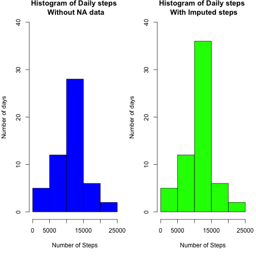

#Loading the activity data into a variable. Make sure the file is in the working directory


```r
activity <- read.csv("activity.csv")
head(activity)
```

```
##   steps       date interval
## 1    NA 2012-10-01        0
## 2    NA 2012-10-01        5
## 3    NA 2012-10-01       10
## 4    NA 2012-10-01       15
## 5    NA 2012-10-01       20
## 6    NA 2012-10-01       25
```

#Histogram of the total number of steps for each day(Ignoring the missing value)


```r
#stepsperday <- with(activity, tapply(steps,date,sum,na.rm=TRUE))
activitywithoutNA<-activity[complete.cases(activity), ]
stepsperday <- activitywithoutNA%>% group_by(date)%>% summarise(sum=sum(steps))
hist(stepsperday$sum,col="blue", main= "Histogram of Daily steps",ylim =c(0,30), xlab="Number of Steps",ylab="Number of days")
```


#Mean and Median number of steps taken each day.


```r
na_mean<-round(mean(stepsperday$sum),2)
na_median<-round(median(stepsperday$sum),2)
```
The Mean of this data with out NA is 1.076619 &times; 10<sup>4</sup> and its median 1.0765 &times; 10<sup>4</sup>

#The interval with the maximum number of steps 


```r
maxinterval <- activitywithoutNA%>% group_by(interval)%>% summarise(sum=sum(steps))
maxinterval<-maxinterval[which(maxinterval$sum == max(maxinterval$sum)),]
interval<-maxinterval$interval
steps<-maxinterval$sum
```
The interval with the Maximun Number of steps 835 and its respective steps 10927.

#Time series plot on the average number of steps per Interval


```r
# removing the na from the data before calculating the average steps per interval
activitywithoutNA<-activity[complete.cases(activity), ]

# calcualting the average steps per interval
avgstepsperint <- activitywithoutNA%>% group_by(interval)%>% summarise(mean=mean(steps))

# plotting the time series for teh above data
plot(avgstepsperint$mean~avgstepsperint$interval,type="l",xlab="Interval",ylab="Avg no of steps",col="red")
```


##Imputing the Missing data for further analysis.
  #1.we will be is the average number of step per day to fill in missing data with their respective dates
  

```r
rowcount <- sum(is.na(activity$steps))
```
The Number of rows with NA is 2304.

  #2.Imputing the avearage steps per interval in the missing data and creating a new data set
  

```r
# joining the main data(activity) with the data set(avgstepsperint) where NA was removed and mean was calculated.

activity_new <- left_join(activity,avgstepsperint, by ="interval")

# replacing NA with the mean of its resprctive interval

activity_new$steps <- with(activity_new,ifelse(is.na(steps),mean,steps))
                           
head(activity_new)
```

```
##       steps       date interval      mean
## 1 1.7169811 2012-10-01        0 1.7169811
## 2 0.3396226 2012-10-01        5 0.3396226
## 3 0.1320755 2012-10-01       10 0.1320755
## 4 0.1509434 2012-10-01       15 0.1509434
## 5 0.0754717 2012-10-01       20 0.0754717
## 6 2.0943396 2012-10-01       25 2.0943396
```

 #3.Creating a histogram with the new imputed data and compating it with the NA data
 

```r
# calculating the new mean 
new_stepsperday <- with(activity_new, tapply(steps,date,sum))

# creatiing a new histogram and ploting it along with precious histogram with NA data

par(mfrow =c(1,2),mar=c(5,4,2,1))

# Histogram for the data set with NA
hist(stepsperday$sum,col="blue", main= "Histogram of Daily steps \n Without NA data",ylim =c(0,40), xlab="Number of Steps",ylab="Number of days")

# Histogram for data with imputed data
hist(new_stepsperday,col="green", main= "Histogram of Daily steps \n With Imputed steps",ylim =c(0,40), xlab="Number of Steps",ylab="Number of days")
```


There is a minor difference in the histogram due to the imputed data.

 #4.Claculating the New mean and median
 

```r
 imputed_mean<-round(mean(new_stepsperday),2)
 imputed_median<-round(median(new_stepsperday),2)
```
The mean of the imputed data set is 1.076619 &times; 10<sup>4</sup> and its median is 1.076619 &times; 10<sup>4</sup>.

#The difference in mean and Median from the data set with NA and imputed data set

```r
mean <- imputed_mean - na_mean
median <- imputed_median - na_median
```

The difference in the mean is 0 and its meidan is 1.19.


#Creating a new factor variable and adding it to the imputed data set

```r
activity_new$date<-as.Date(activity_new$date)
activity_new$weekend<-ifelse(weekdays(activity_new$date,abbreviate=TRUE) %in% c("Sun","Sat"), "Weekend","Weekday")
activity_new$weekend <- as.factor(activity_new$weekend)
head(activity_new)
```

```
##       steps       date interval      mean weekend
## 1 1.7169811 2012-10-01        0 1.7169811 Weekday
## 2 0.3396226 2012-10-01        5 0.3396226 Weekday
## 3 0.1320755 2012-10-01       10 0.1320755 Weekday
## 4 0.1509434 2012-10-01       15 0.1509434 Weekday
## 5 0.0754717 2012-10-01       20 0.0754717 Weekday
## 6 2.0943396 2012-10-01       25 2.0943396 Weekday
```

#Creating a plot that shows the number of steps in the inverval over the new variable weekend


```r
# Aggregrating the number of steps over interval and weekend
weekday <- activity_new%>% group_by(interval,weekend)%>% summarise(sum=mean(steps))

#Plotting the number of steps in the inverval over the new variable weekend
ggplot(weekday,aes(interval,sum,col=weekend)) + geom_line() + facet_grid(weekend~.,) + ylab("Number of Steps")
```


# This Conclude the Analysis of Activity data
